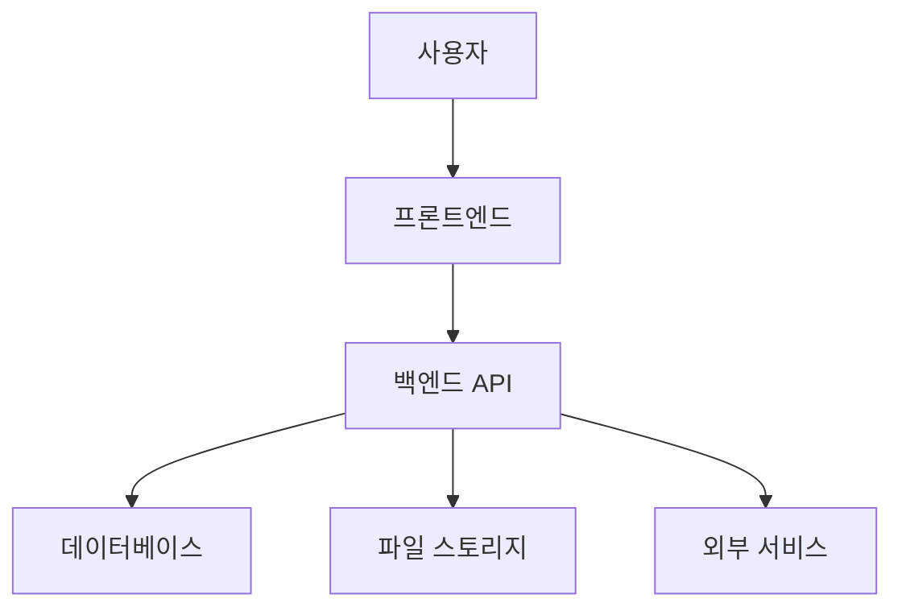

# 건설 관리 시스템 아키텍처

*최종 업데이트: 2024-03-21*

> 이 문서는 시스템의 전반적인 아키텍처를 설명합니다. 상세한 내용은 다음 문서들을 참조하세요:
> - [프론트엔드 아키텍처](frontend_architecture.md)
> - [데이터베이스 스키마](database_schema.md)
> - [API 설계](api/v1/api.md)

## 1. 시스템 개요

이 시스템은 Tauri를 기반으로 한 데스크톱 애플리케이션으로, 건설 프로젝트의 효율적인 관리를 지원합니다.

### 1.1 주요 기능
- 프로젝트 관리 - [상세 보기](components.md#프로젝트-관리)
- 태스크 관리 - [상세 보기](components.md#태스크-관리)
- 사용자 관리 - [상세 보기](components.md#사용자-관리)
- 대시보드 및 보고서 - [상세 보기](components.md#대시보드)

### 1.2 기술 스택
- 프론트엔드: React + TypeScript - [상세 구성](frontend_architecture.md#기술-스택)
- 백엔드: Python + FastAPI - [API 문서](api.md)
- 데이터베이스: PostgreSQL - [스키마 설계](database_schema.md)
- UI 프레임워크: Material-UI

## 2. 시스템 아키텍처

### 2.1 전체 구조

### 2.2 계층 구조
- 프레젠테이션 계층 - [상세 보기](frontend_architecture.md#계층-구조)
- 비즈니스 로직 계층 - [상세 보기](api/v1/api.md#비즈니스-로직)
- 데이터 접근 계층 - [상세 보기](database_schema.md#접근-계층)

## 3. 주요 컴포넌트

### 3.1 프론트엔드 구조
자세한 내용은 [프론트엔드 아키텍처](frontend_architecture.md)를 참조하세요.

### 3.2 백엔드 구조
자세한 내용은 [API 문서](api.md)를 참조하세요.

### 3.3 데이터베이스 구조
자세한 내용은 [데이터베이스 스키마](database_schema.md)를 참조하세요.

## 4. 통신 프로토콜

### 4.1 내부 통신
- REST API - [엔드포인트 목록](api_endpoints.md)
- WebSocket - [실시간 통신](api/v1/api.md#websocket)

### 4.2 외부 통신
- OAuth2 인증 - [인증 가이드](api/common/authentication.md)
- 파일 업로드/다운로드 - [파일 처리](api/v1/api.md#파일-처리)

## 5. 보안 아키텍처
자세한 내용은 [보안 가이드](api/common/security.md)를 참조하세요.

## 6. 성능 최적화

### 6.1 프론트엔드 최적화
자세한 내용은 [프론트엔드 성능](frontend_architecture.md#성능-최적화)을 참조하세요.

### 6.2 백엔드 최적화
- 캐싱 전략
- 데이터베이스 인덱싱
- 비동기 처리

## 7. 확장성 고려사항

### 7.1 수평적 확장
- 마이크로서비스 전환 계획
- 로드 밸런싱 전략

### 7.2 수직적 확장
- 데이터베이스 파티셔닝
- 캐시 계층 추가

## 8. 개발 환경
자세한 내용은 [개발 가이드](development/development-guide.md)를 참조하세요.

## 9. 모니터링 및 로깅
- 성능 모니터링
- 에러 추적
- 사용자 행동 분석

## 10. 재해 복구
- 백업 전략
- 장애 복구 계획
- 비상 운영 절차 