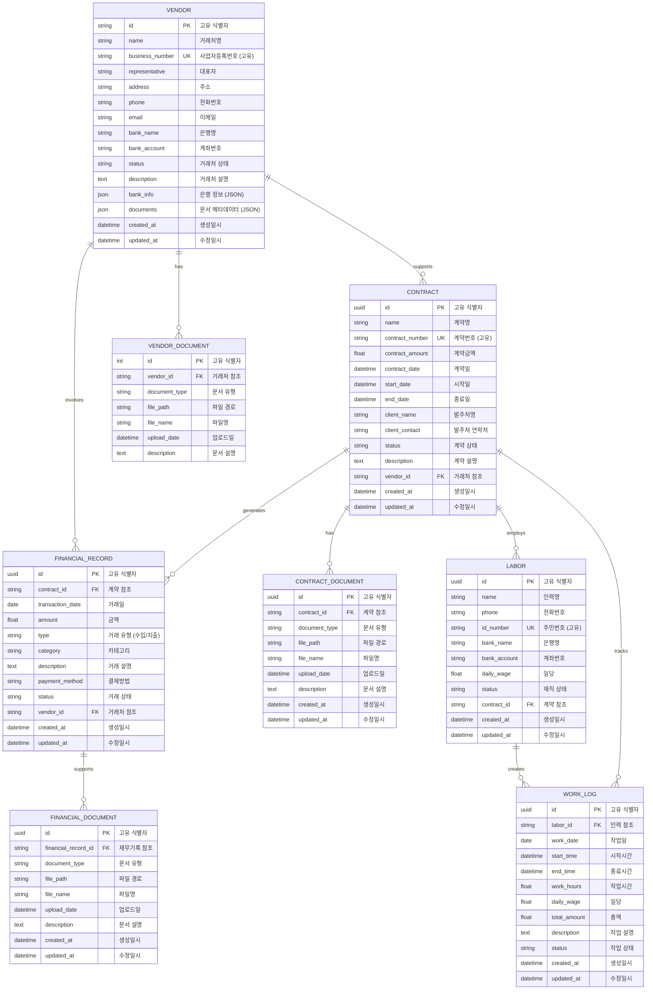
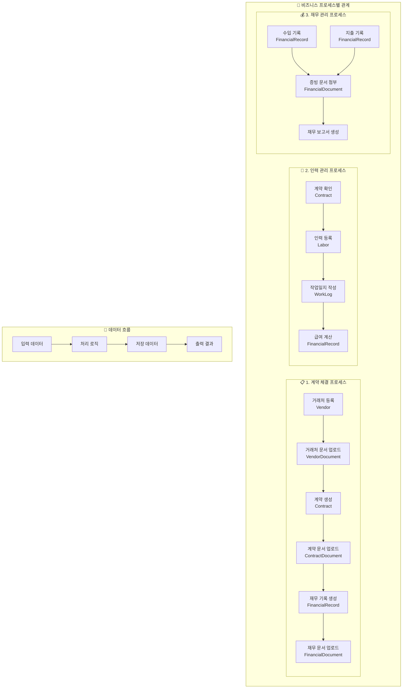
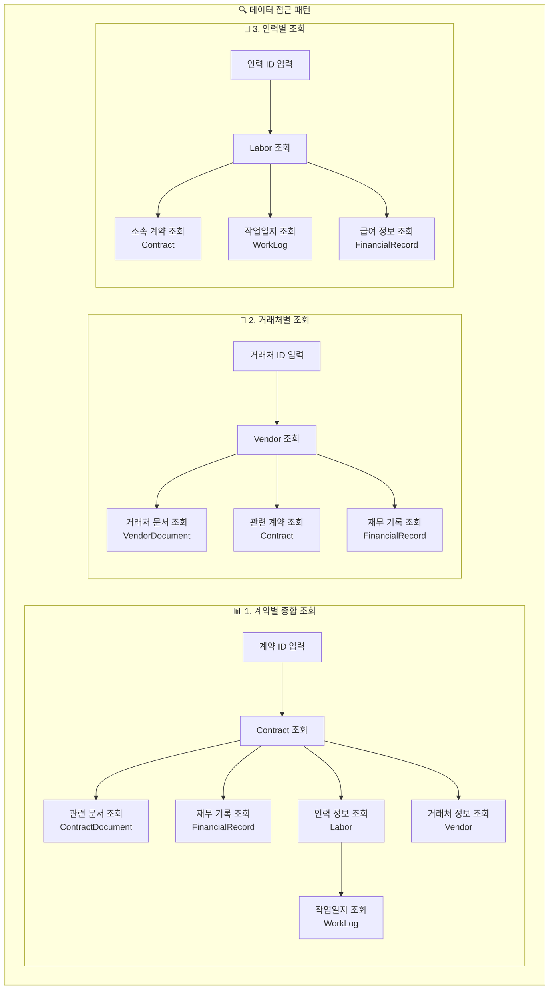
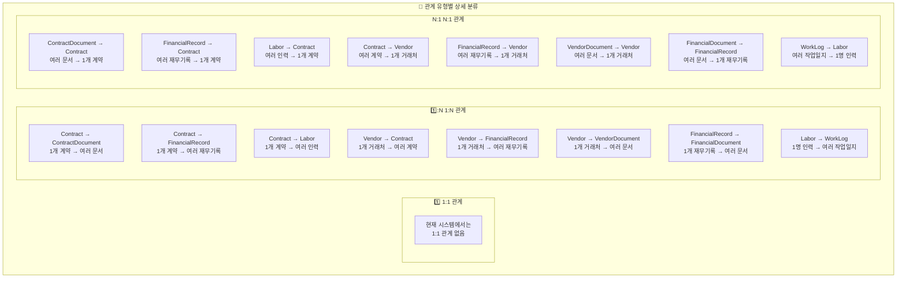
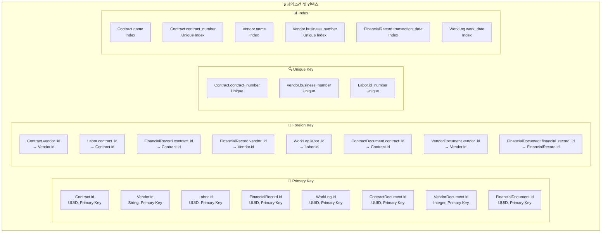
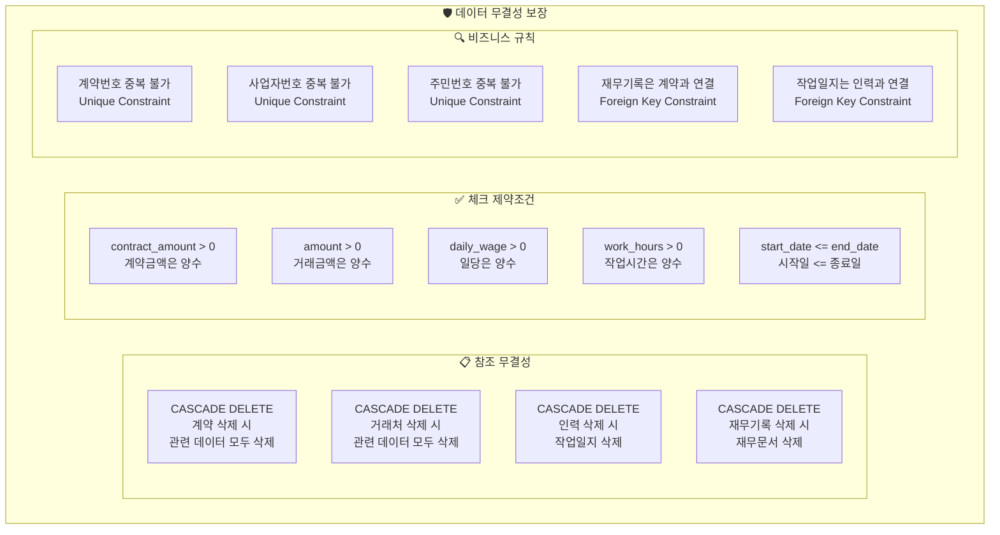
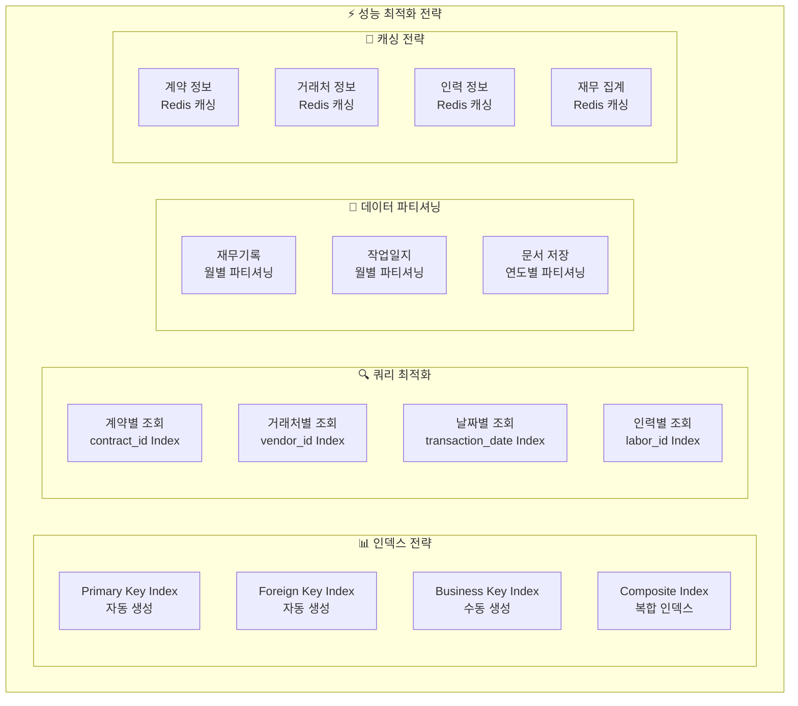
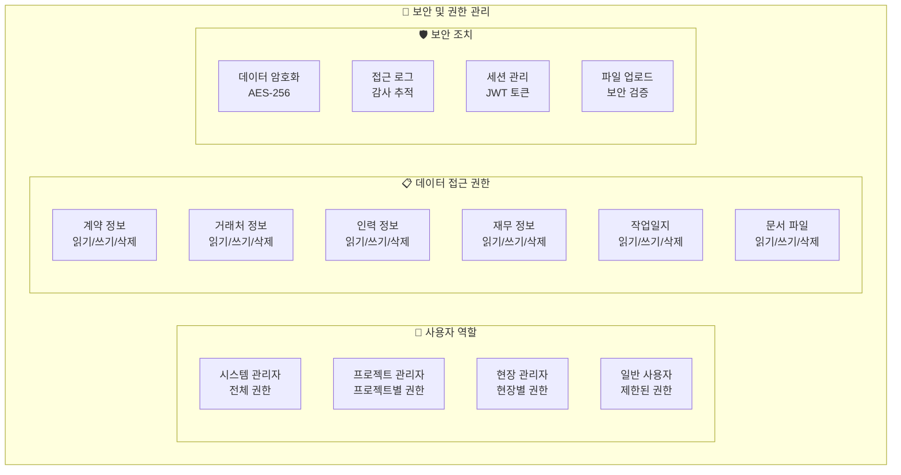
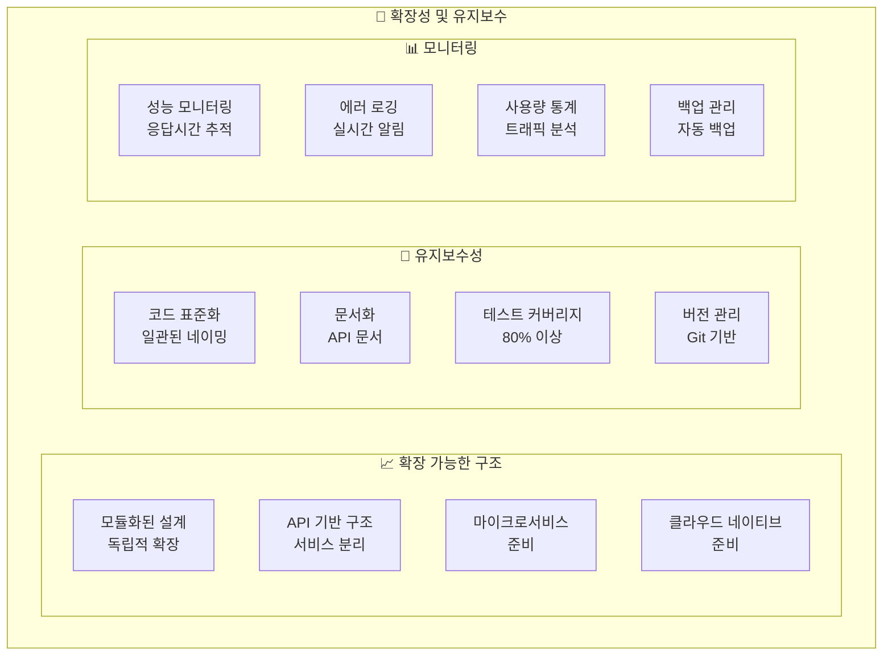

# 건설 관리 시스템 - 복합적 스키마 관계도

## 🏗️ 전체 시스템 복합 관계도 (Comprehensive Schema Relationship)

### **1. 완전한 ERD 다이어그램**



### **2. 상세한 관계 흐름도**

```mermaid
graph TB
    subgraph "🏢 핵심 비즈니스 엔티티"
        subgraph "📋 계약 관리"
            A[Contract<br/>계약<br/>• 계약명, 계약번호<br/>• 계약금액, 계약일<br/>• 시작일, 종료일<br/>• 발주처, 상태]
        end
        
        subgraph "🏪 거래처 관리"
            B[Vendor<br/>거래처<br/>• 거래처명, 사업자번호<br/>• 대표자, 주소<br/>• 연락처, 이메일<br/>• 은행정보, 상태]
        end
        
        subgraph "👷 인력 관리"
            C[Labor<br/>인력<br/>• 이름, 전화번호<br/>• 주민번호, 은행정보<br/>• 일당, 재직상태<br/>• 계약 연결]
        end
    end
    
    subgraph "📄 문서 관리 시스템"
        subgraph "계약 문서"
            D[ContractDocument<br/>계약 문서<br/>• 문서 유형<br/>• 파일 경로, 파일명<br/>• 업로드일, 설명]
        end
        
        subgraph "거래처 문서"
            E[VendorDocument<br/>거래처 문서<br/>• 사업자등록증<br/>• 통장사본<br/>• 기타 서류]
        end
        
        subgraph "재무 문서"
            F[FinancialDocument<br/>재무 문서<br/>• 영수증, 세금계산서<br/>• 입금확인서<br/>• 지출증빙]
        end
    end
    
    subgraph "💰 재무 관리 시스템"
        G[FinancialRecord<br/>재무 기록<br/>• 거래일, 금액<br/>• 유형(수입/지출)<br/>• 카테고리, 설명<br/>• 결제방법, 상태]
    end
    
    subgraph "📝 작업 관리 시스템"
        H[WorkLog<br/>작업일지<br/>• 작업일, 시작/종료시간<br/>• 작업시간, 일당<br/>• 총액, 작업설명<br/>• 작업상태]
    end
    
    %% 핵심 관계
    A -->|"1:N<br/>계약당 여러 문서"| D
    A -->|"1:N<br/>계약당 여러 재무기록"| G
    A -->|"1:N<br/>계약당 여러 인력"| C
    A -->|"1:N<br/>계약당 여러 작업일지"| H
    
    B -->|"1:N<br/>거래처당 여러 계약"| A
    B -->|"1:N<br/>거래처당 여러 재무기록"| G
    B -->|"1:N<br/>거래처당 여러 문서"| E
    
    C -->|"1:N<br/>인력당 여러 작업일지"| H
    
    G -->|"1:N<br/>재무기록당 여러 문서"| F
    
    %% 외래키 관계 표시
    A -.->|"vendor_id FK"| B
    C -.->|"contract_id FK"| A
    G -.->|"contract_id FK<br/>vendor_id FK"| A
    G -.->|"vendor_id FK"| B
    H -.->|"labor_id FK"| C
    D -.->|"contract_id FK"| A
    E -.->|"vendor_id FK"| B
    F -.->|"financial_record_id FK"| G
```

### **3. 비즈니스 프로세스별 상세 관계도**



### **4. 상세한 데이터 접근 패턴 다이어그램**



### **5. 상세한 관계 유형별 분류도**



### **6. 상세한 제약조건 및 인덱스 다이어그램**



### **7. 상세한 데이터 무결성 다이어그램**



### **8. 상세한 성능 최적화 다이어그램**



### **9. 상세한 보안 및 권한 다이어그램**



### **10. 상세한 확장성 및 유지보수 다이어그램**



이러한 상세한 다이어그램들을 통해 건설 관리 시스템의 복합적인 스키마 관계를 완전히 이해할 수 있습니다. 각 다이어그램은 특정 관점에서 시스템의 구조와 관계를 보여주며, 전체적으로는 시스템의 완전한 아키텍처를 제공합니다. 