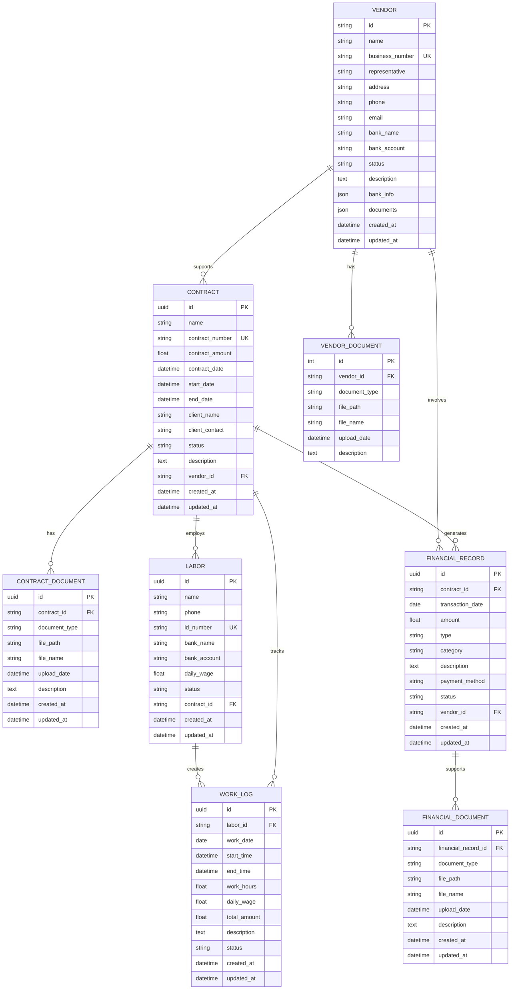

# 건설 관리 시스템 ERD (Entity Relationship Diagram)

## 📊 전체 ERD 구조



## 🔗 핵심 연관관계 설명

### 1. **계약 중심 구조**
- **Contract**가 시스템의 핵심 엔티티
- 모든 비즈니스 활동이 계약을 중심으로 연결됨

### 2. **1:N 관계들**
- 1개 계약 → 여러 문서 (ContractDocument)
- 1개 계약 → 여러 재무기록 (FinancialRecord)
- 1개 계약 → 여러 인력 (Labor)
- 1개 거래처 → 여러 계약 (Contract)

### 3. **문서 관리 구조**
- 각 엔티티별로 관련 문서를 별도 테이블로 관리
- ContractDocument, VendorDocument, FinancialDocument

### 4. **재무 관리 구조**
- FinancialRecord가 계약과 거래처를 연결
- 모든 금전적 거래를 추적 가능

## 📋 관계 유형별 분류

### **1:1 관계**
- 없음 (현재 구조에서는)

### **1:N 관계**
- Contract → ContractDocument
- Contract → FinancialRecord
- Contract → Labor
- Vendor → Contract
- Vendor → FinancialRecord
- Vendor → VendorDocument
- FinancialRecord → FinancialDocument
- Labor → WorkLog

### **N:1 관계**
- ContractDocument → Contract
- FinancialRecord → Contract
- Labor → Contract
- Contract → Vendor
- FinancialRecord → Vendor
- VendorDocument → Vendor
- FinancialDocument → FinancialRecord
- WorkLog → Labor

## 🎯 비즈니스 관점에서의 관계

### **계약 관리 관점**
```
계약 → 문서 (계약서, 견적서, 명세서)
계약 → 재무기록 (수입/지출 내역)
계약 → 인력 (일용직 명부)
```

### **거래처 관리 관점**
```
거래처 → 계약 (수주/하도급 계약)
거래처 → 재무기록 (거래 내역)
거래처 → 문서 (사업자등록증, 통장사본)
```

### **재무 관리 관점**
```
재무기록 → 계약 (어떤 계약의 수입/지출)
재무기록 → 거래처 (누구와의 거래)
재무기록 → 문서 (영수증, 세금계산서)
```

### **인력 관리 관점**
```
인력 → 계약 (어떤 계약에서 일하는지)
인력 → 작업일지 (일별 작업 기록)
``` 