# 건설 관리 시스템 - 시각적 다이어그램

## 📊 1. 전체 시스템 구조도

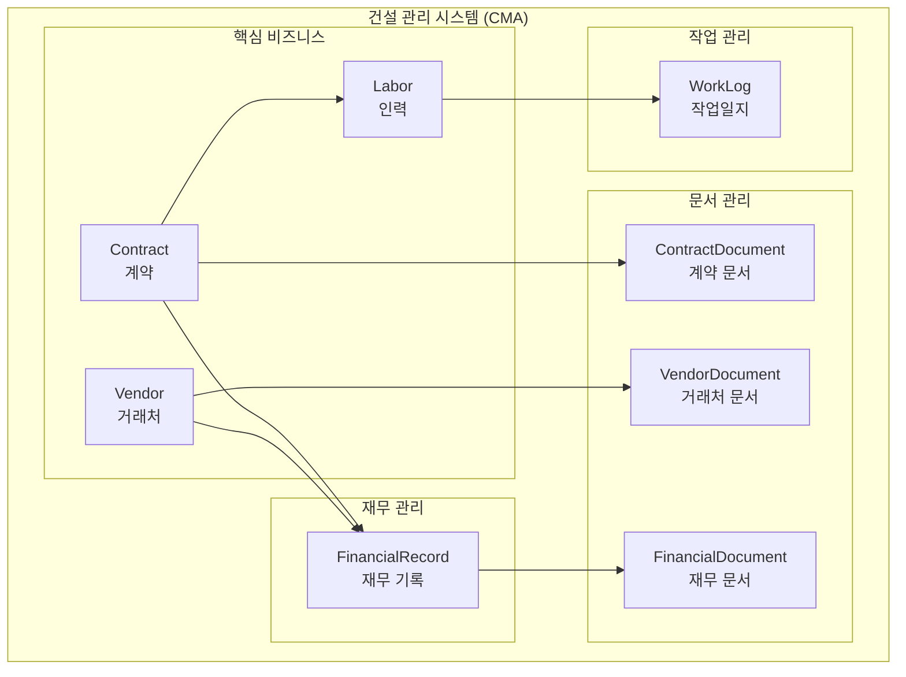

## 🔗 2. 관계 유형별 다이어그램

### **2.1 1:N 관계**
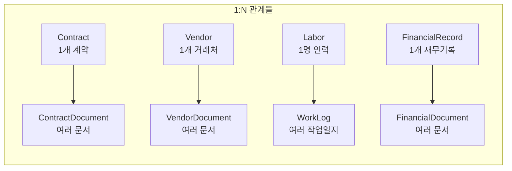

### **2.2 N:1 관계**
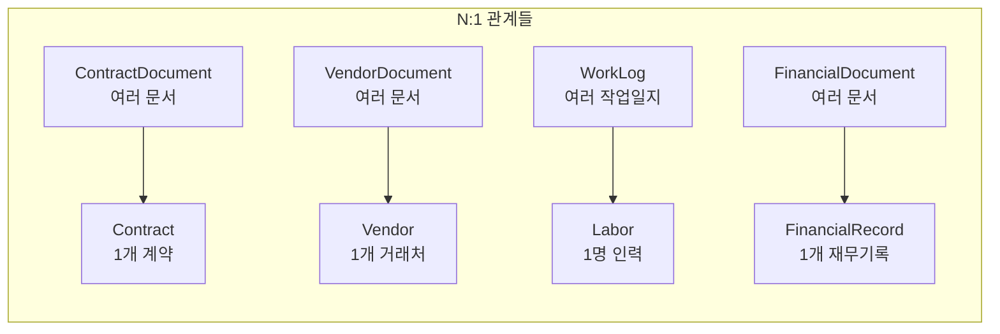

### **2.3 복합 관계**
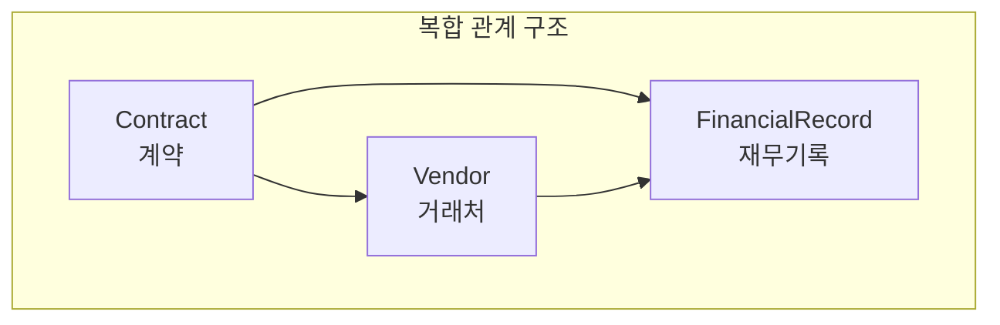

## 🏗️ 3. 계층 구조 다이어그램

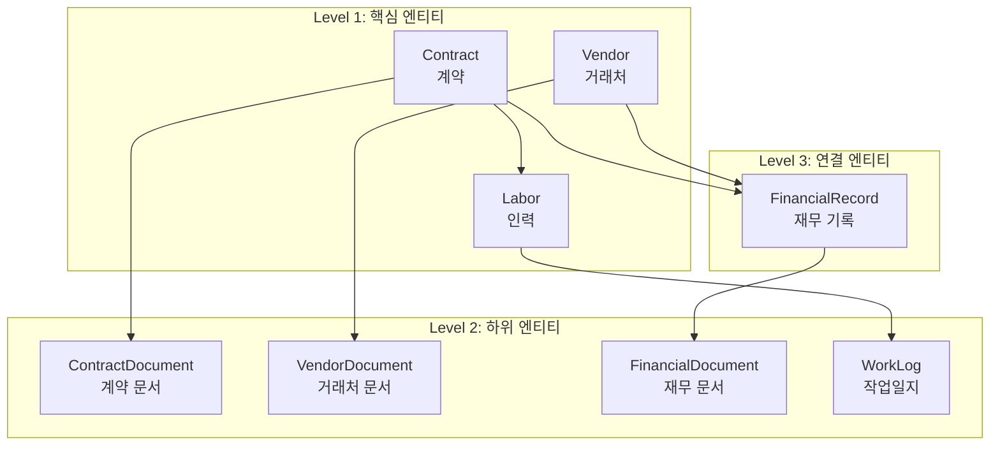

## 🔄 4. 데이터 흐름 다이어그램

### **4.1 계약 체결 프로세스**
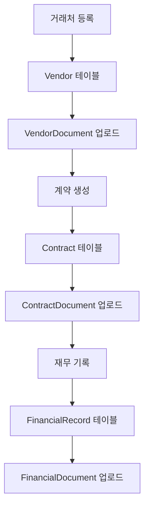

### **4.2 인력 관리 프로세스**
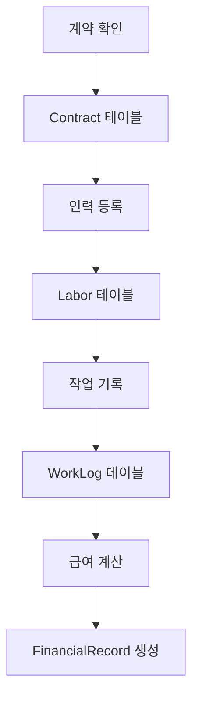

## 📈 5. 비즈니스 관점 다이어그램

### **5.1 계약 중심 구조**
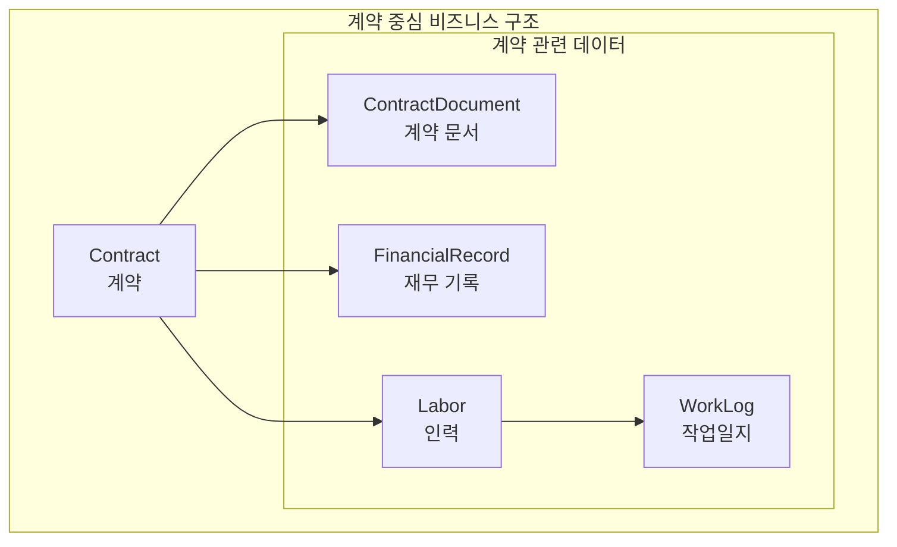

### **5.2 거래처 중심 구조**
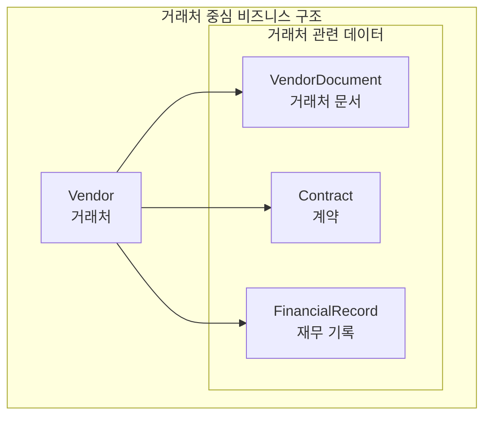

## 🎯 6. 사용자 관점 다이어그램

### **6.1 관리자 관점**
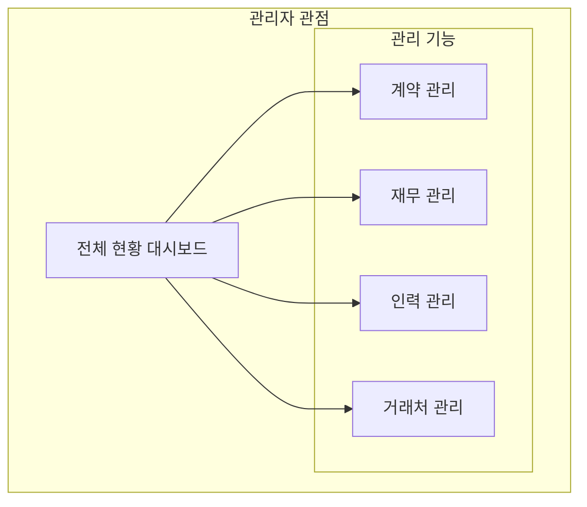

### **6.2 현장 관리자 관점**
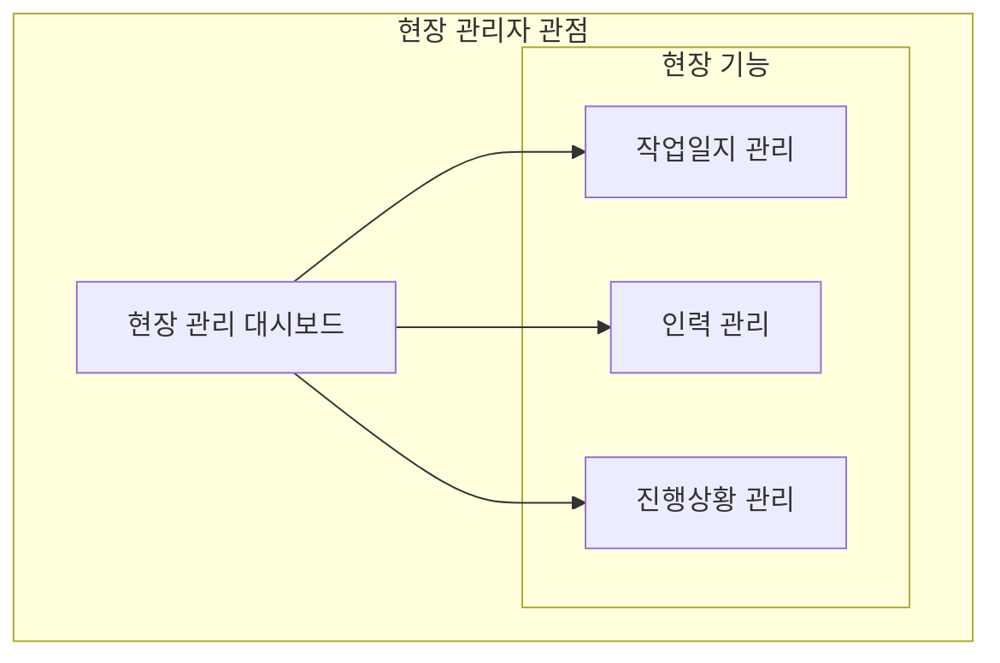

## 🔍 7. 데이터 접근 패턴 다이어그램

### **7.1 계약별 조회 패턴**
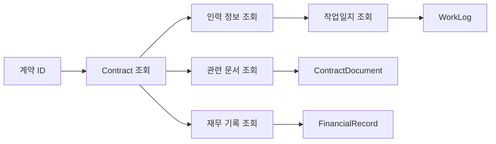

### **7.2 거래처별 조회 패턴**
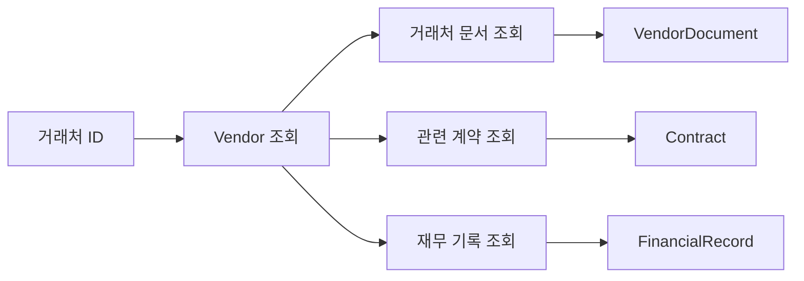

## 📊 8. 성능 최적화 다이어그램

### **8.1 인덱스 전략**
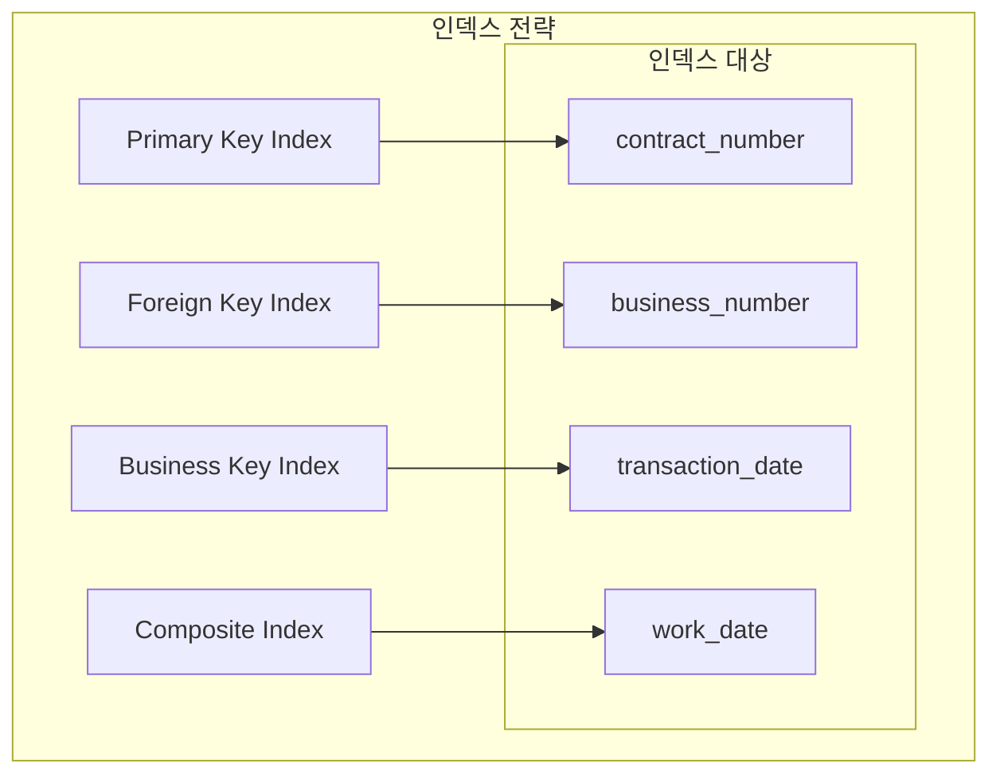

### **8.2 쿼리 최적화**
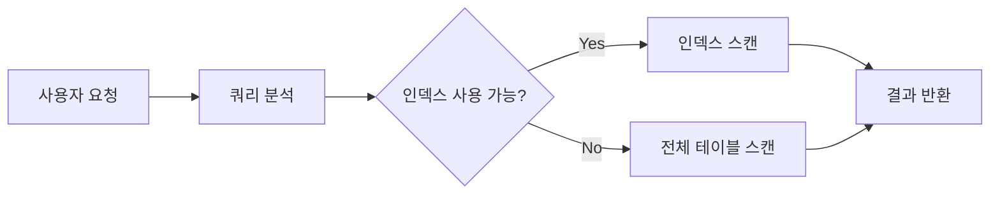

## 🛡️ 9. 보안 및 권한 다이어그램

### **9.1 데이터 접근 권한**
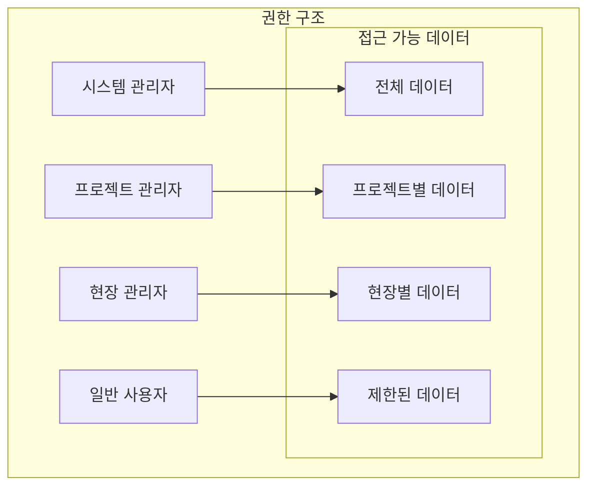

## 🔄 10. 데이터 동기화 다이어그램

### **10.1 온라인/오프라인 동기화**
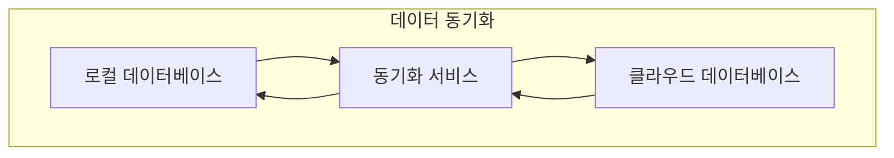

이러한 시각적 다이어그램들을 통해 설계 요청자는 복잡한 데이터베이스 구조를 직관적으로 이해할 수 있습니다. 