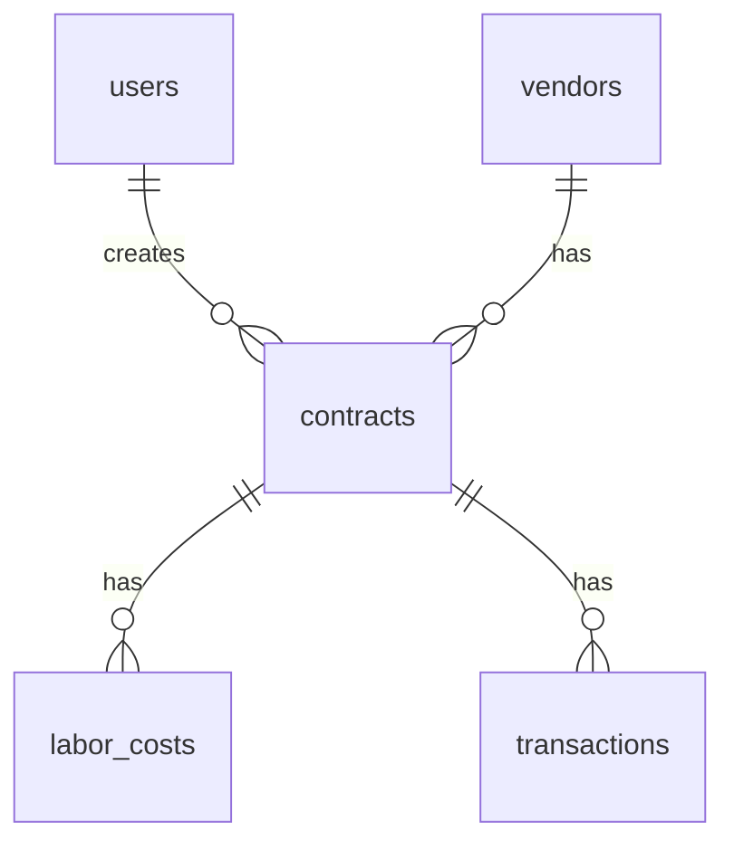

# 데이터베이스 스키마 설계

## 1. 테이블 구조

### 1.1 사용자 테이블 (users)
```sql
CREATE TABLE users (
    id UUID PRIMARY KEY DEFAULT uuid_generate_v4(),
    email TEXT UNIQUE NOT NULL,
    name TEXT NOT NULL,
    role TEXT NOT NULL,
    created_at TIMESTAMP WITH TIME ZONE DEFAULT NOW()
);
```
- **용도**: 시스템 사용자 관리
- **주요 필드**:
  - `id`: 사용자 고유 식별자
  - `email`: 로그인용 이메일
  - `name`: 사용자 이름
  - `role`: 사용자 권한 (admin, manager, user)
  - `created_at`: 계정 생성 시간

### 1.2 거래처 테이블 (vendors)
```sql
CREATE TABLE vendors (
    id UUID PRIMARY KEY DEFAULT uuid_generate_v4(),
    company_name TEXT NOT NULL,
    business_number TEXT UNIQUE NOT NULL,
    representative TEXT NOT NULL,
    address TEXT NOT NULL,
    contact TEXT NOT NULL,
    bank_info JSONB,
    documents JSONB,
    created_at TIMESTAMP WITH TIME ZONE DEFAULT NOW(),
    updated_at TIMESTAMP WITH TIME ZONE DEFAULT NOW()
);
```
- **용도**: 거래처 정보 관리
- **주요 필드**:
  - `id`: 거래처 고유 식별자
  - `company_name`: 회사명
  - `business_number`: 사업자등록번호
  - `representative`: 대표자명
  - `bank_info`: 계좌 정보 (JSON)
  - `documents`: 관련 문서 메타데이터 (JSON)

### 1.3 계약 테이블 (contracts)
```sql
CREATE TABLE contracts (
    id UUID PRIMARY KEY DEFAULT uuid_generate_v4(),
    project_name TEXT NOT NULL,
    contract_amount DECIMAL NOT NULL,
    contract_date DATE NOT NULL,
    vendor_id UUID REFERENCES vendors(id),
    status TEXT NOT NULL,
    documents JSONB,
    checklist JSONB,
    created_at TIMESTAMP WITH TIME ZONE DEFAULT NOW(),
    updated_at TIMESTAMP WITH TIME ZONE DEFAULT NOW()
);
```
- **용도**: 계약 정보 관리
- **주요 필드**:
  - `id`: 계약 고유 식별자
  - `project_name`: 공사명
  - `contract_amount`: 계약금액
  - `vendor_id`: 거래처 참조
  - `status`: 계약 상태
  - `documents`: 계약서 및 첨부문서 메타데이터
  - `checklist`: 계약 절차 체크리스트

### 1.4 노무비 테이블 (labor_costs)
```sql
CREATE TABLE labor_costs (
    id UUID PRIMARY KEY DEFAULT uuid_generate_v4(),
    contract_id UUID REFERENCES contracts(id),
    worker_name TEXT NOT NULL,
    work_date DATE NOT NULL,
    daily_wage DECIMAL NOT NULL,
    work_type TEXT NOT NULL,
    work_log JSONB,
    created_at TIMESTAMP WITH TIME ZONE DEFAULT NOW()
);
```
- **용도**: 노무비 관리
- **주요 필드**:
  - `id`: 노무비 기록 고유 식별자
  - `contract_id`: 계약 참조
  - `worker_name`: 작업자 이름
  - `work_date`: 작업일
  - `daily_wage`: 일당
  - `work_log`: 작업일지 메타데이터

### 1.5 매출/지출 테이블 (transactions)
```sql
CREATE TABLE transactions (
    id UUID PRIMARY KEY DEFAULT uuid_generate_v4(),
    contract_id UUID REFERENCES contracts(id),
    transaction_type TEXT NOT NULL,
    amount DECIMAL NOT NULL,
    transaction_date DATE NOT NULL,
    category TEXT NOT NULL,
    description TEXT,
    documents JSONB,
    created_at TIMESTAMP WITH TIME ZONE DEFAULT NOW()
);
```
- **용도**: 매출/지출 관리
- **주요 필드**:
  - `id`: 거래 고유 식별자
  - `contract_id`: 계약 참조
  - `transaction_type`: 거래 유형 (수입/지출)
  - `amount`: 금액
  - `category`: 거래 카테고리
  - `documents`: 관련 문서 메타데이터

## 2. 인덱스 설계

### 2.1 성능 최적화를 위한 인덱스
```sql
-- 거래처 검색 최적화
CREATE INDEX idx_vendors_company_name ON vendors(company_name);
CREATE INDEX idx_vendors_business_number ON vendors(business_number);

-- 계약 검색 최적화
CREATE INDEX idx_contracts_project_name ON contracts(project_name);
CREATE INDEX idx_contracts_vendor_id ON contracts(vendor_id);
CREATE INDEX idx_contracts_status ON contracts(status);

-- 노무비 검색 최적화
CREATE INDEX idx_labor_costs_contract_id ON labor_costs(contract_id);
CREATE INDEX idx_labor_costs_work_date ON labor_costs(work_date);

-- 거래 검색 최적화
CREATE INDEX idx_transactions_contract_id ON transactions(contract_id);
CREATE INDEX idx_transactions_transaction_date ON transactions(transaction_date);
```

## 3. 관계도



## 4. 데이터 마이그레이션 전략

### 4.1 개발 → 테스트 → 프로덕션
1. 개발 환경에서 스키마 변경 테스트
2. 테스트 환경에서 데이터 마이그레이션 검증
3. 프로덕션 환경 적용

### 4.2 백업 전략
- 일일 자동 백업
- 주요 변경 전 수동 백업
- 백업 데이터 암호화 저장

## 5. 보안 고려사항

### 5.1 데이터 접근 제어
- Row Level Security (RLS) 적용
- 사용자 역할별 접근 권한 설정
- 민감 정보 암호화

### 5.2 감사 로그
- 중요 데이터 변경 이력 추적
- 사용자 활동 로그 기록 