# 스키마 진화를 위한 시각적 개발 워크플로우

## 🎯 스키마 수정 시 다이어그램 활용 전략

### **1. 스키마 변경 관리 프로세스**

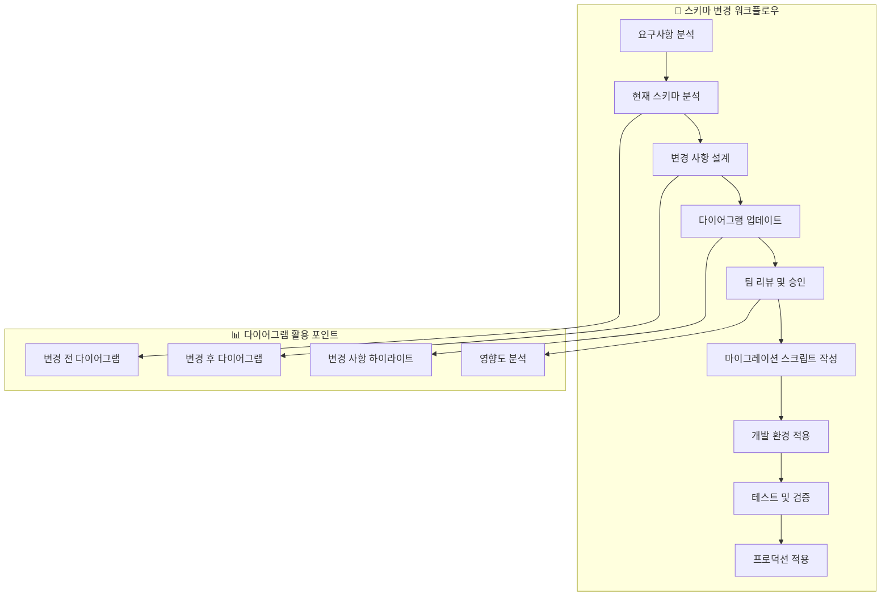

## 🛠️ 다이어그램 기반 스키마 수정 방법

### **1. 변경 사항 시각화**

#### **1.1 변경 전후 비교 다이어그램**

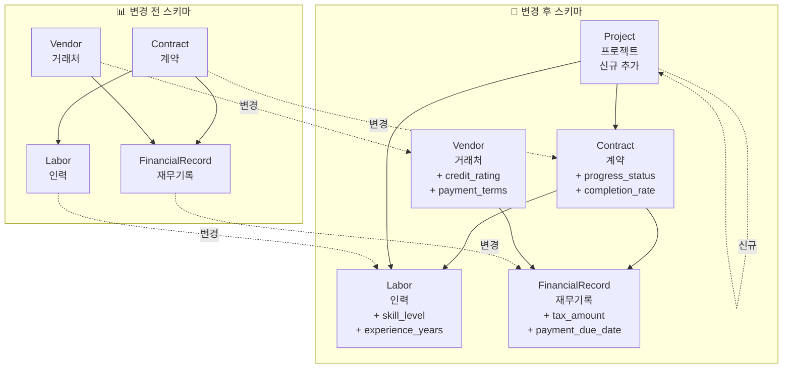

#### **1.2 변경 사항 하이라이트 다이어그램**

```mermaid
graph TB
    subgraph "🔴 삭제된 요소"
        C1[기존 필드: contract_type<br/>삭제 예정]
    end
    
    subgraph "🟡 수정된 요소"
        C2[contract_amount<br/>DECIMAL(15,2) → DECIMAL(20,2)]
        C3[status<br/>VARCHAR(50) → ENUM]
    end
    
    subgraph "🟢 추가된 요소"
        C4[progress_status<br/>VARCHAR(50)]
        C5[completion_rate<br/>DECIMAL(5,2)]
        C6[Project 테이블<br/>신규 엔티티]
    end
    
    subgraph "🔵 관계 변경"
        C7[Contract → Project<br/>N:1 관계 추가]
        C8[Labor → Project<br/>N:1 관계 추가]
    end
```

### **2. 영향도 분석 다이어그램**

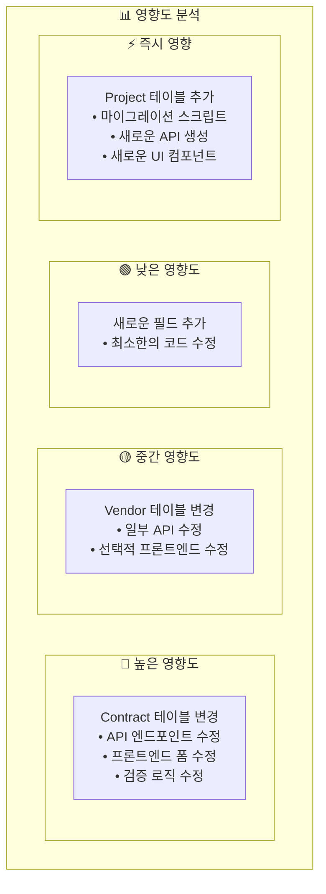

## 🔄 단계별 스키마 진화 프로세스

### **1단계: 요구사항 분석 및 현재 상태 파악**

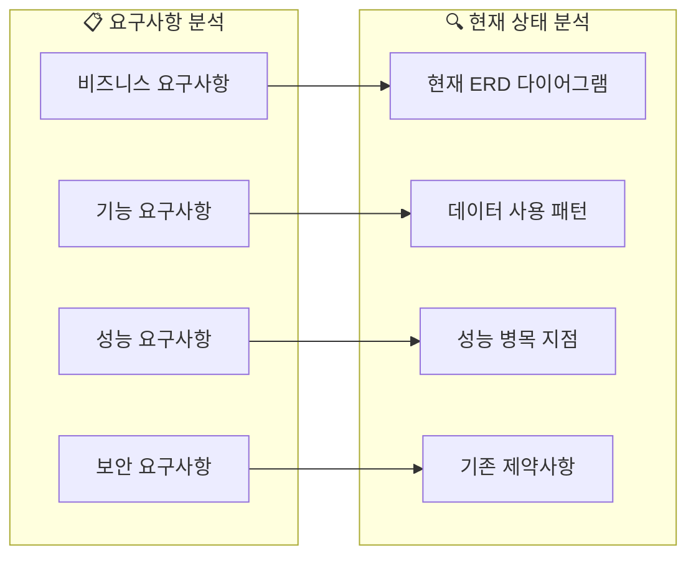

### **2단계: 변경 사항 설계**

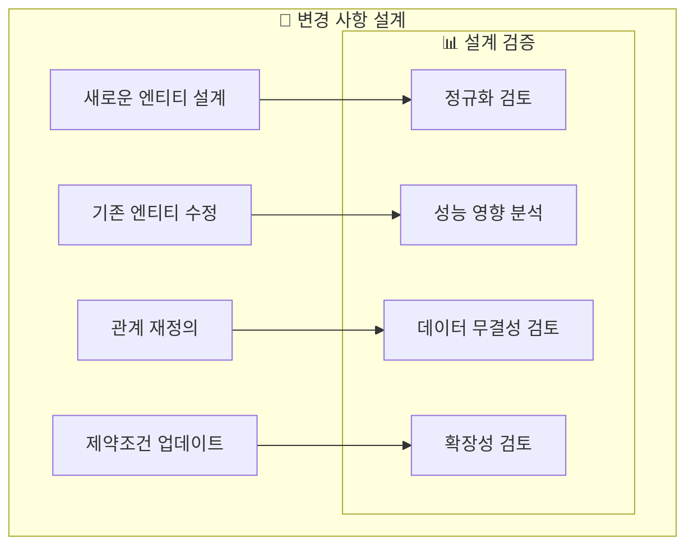

### **3단계: 다이어그램 업데이트**

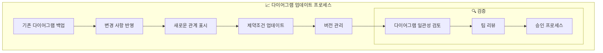

## 🛠️ 실무 적용 방법

### **1. Git 기반 다이어그램 버전 관리**

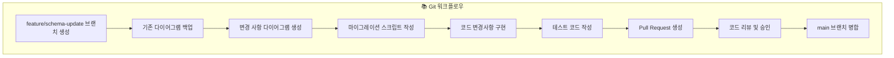

### **2. 다이어그램 기반 개발 체크리스트**

```mermaid
graph TB
    subgraph "✅ 개발 체크리스트"
        F1[다이어그램 업데이트 완료]
        F2[마이그레이션 스크립트 작성]
        F3[모델 클래스 수정]
        F4[API 엔드포인트 수정]
        F5[스키마 검증 로직 수정]
        F6[프론트엔드 폼 수정]
        F7[테스트 코드 작성]
        F8[문서 업데이트]
        
        subgraph "🔍 검증 단계"
            F9[단위 테스트 통과]
            F10[통합 테스트 통과]
            F11[성능 테스트 통과]
            F12[보안 검토 통과]
        end
    end
    
    F1 --> F2
    F2 --> F3
    F3 --> F4
    F4 --> F5
    F5 --> F6
    F6 --> F7
    F7 --> F8
    F8 --> F9
    F9 --> F10
    F10 --> F11
    F11 --> F12
```

## 📊 다이어그램 활용 도구 및 방법

### **1. Mermaid 기반 다이어그램 관리**

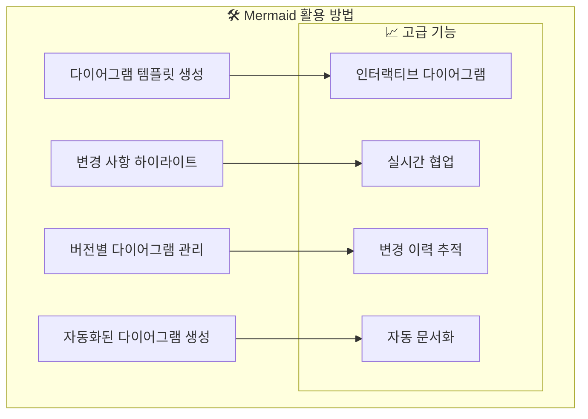

### **2. 자동화된 스키마 변경 감지**

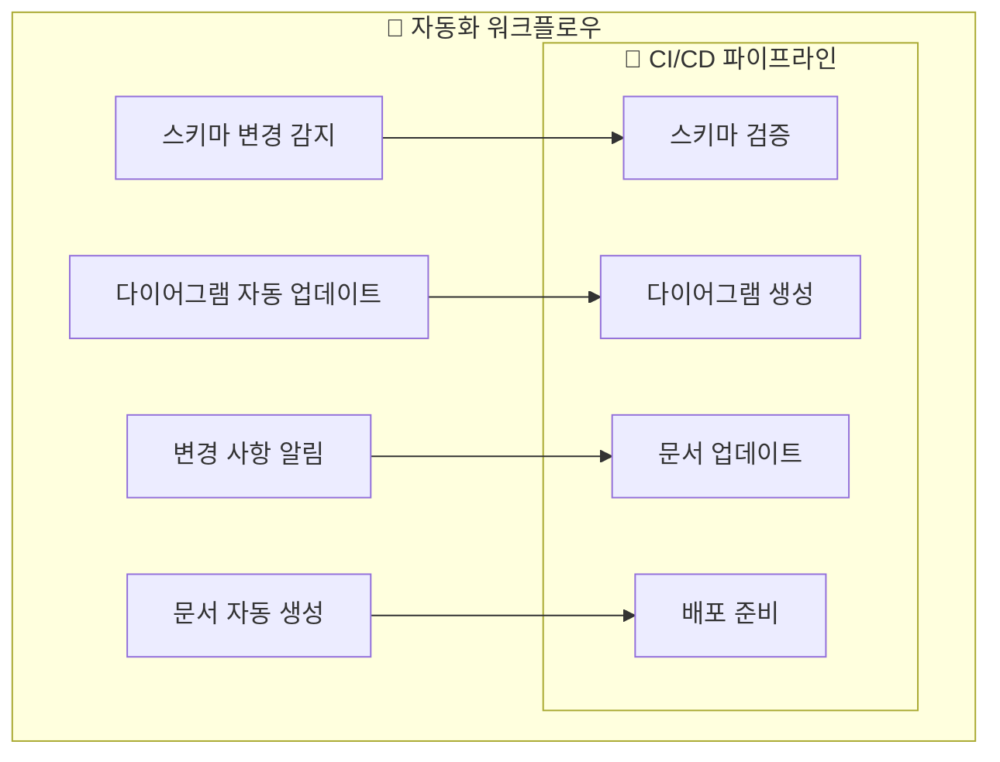

## 🎯 실제 적용 시나리오

### **시나리오 1: 새로운 기능 추가**

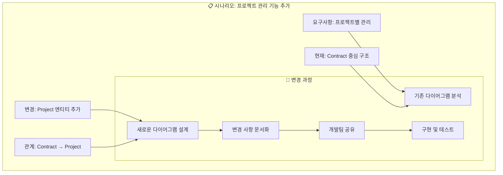

### **시나리오 2: 성능 최적화**

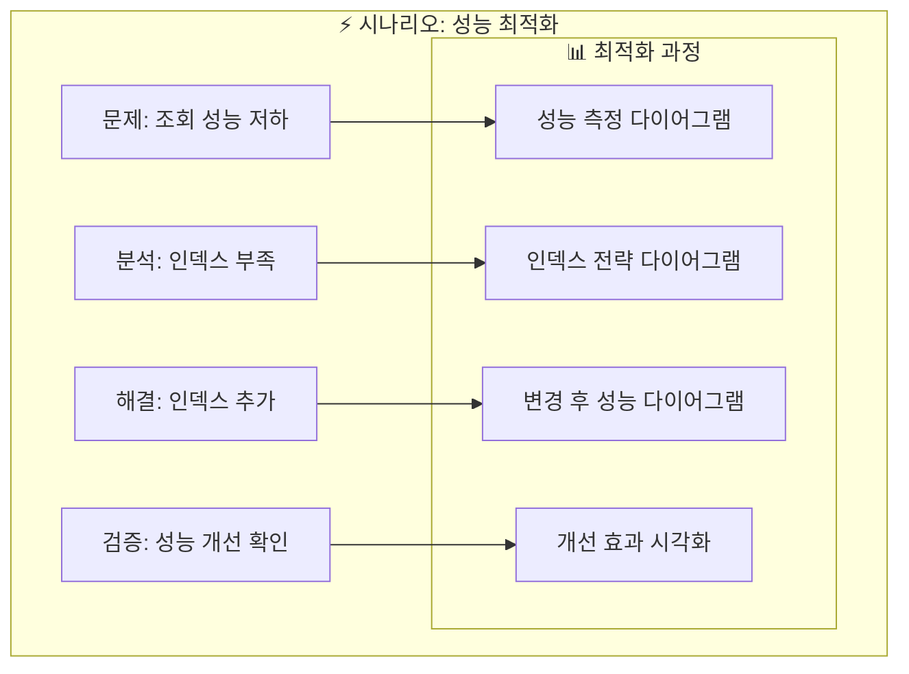

## 🚀 장점 및 효과

### **1. 시각적 이해도 향상**

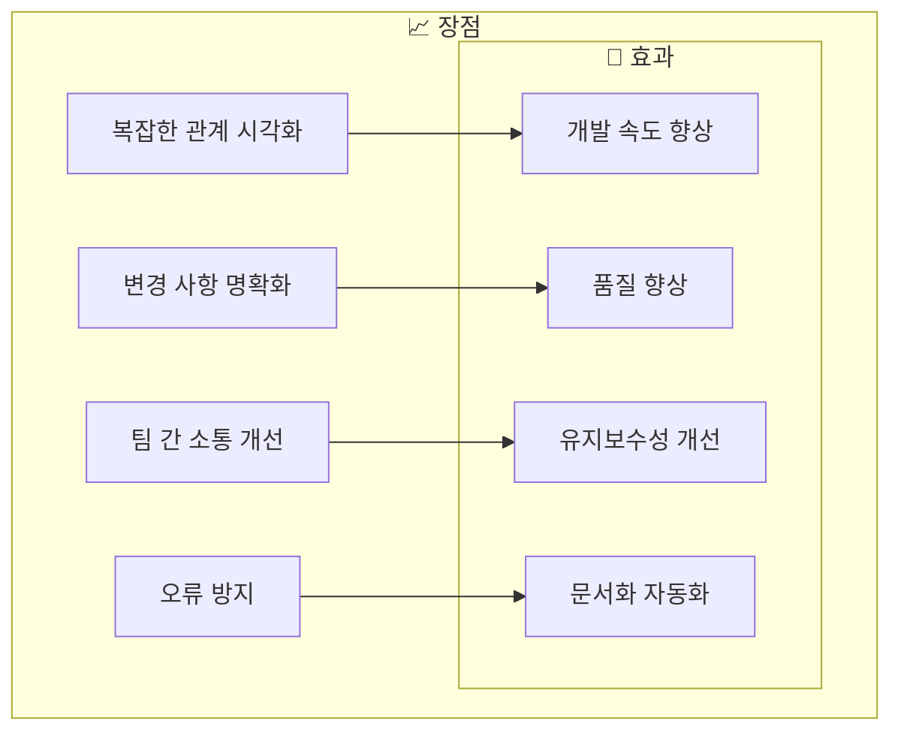

### **2. 협업 효율성 증대**

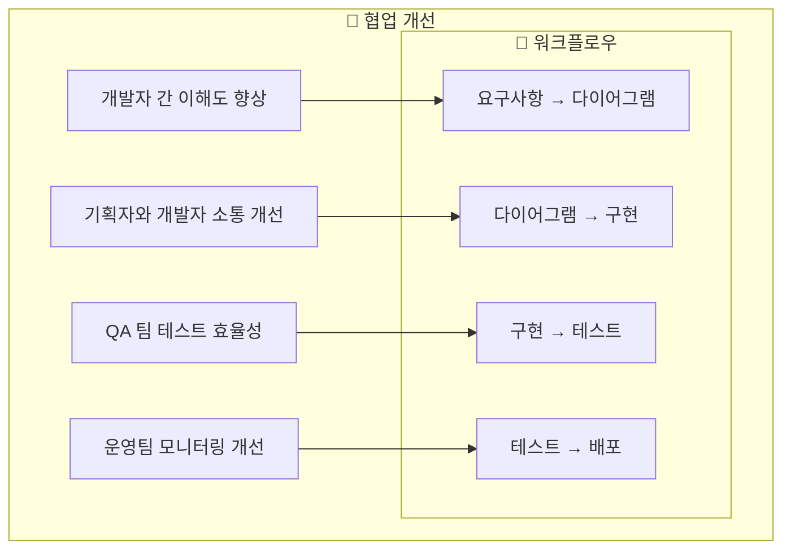

이러한 방법을 통해 스키마 변경 시 다이어그램을 효과적으로 활용하여 개발 프로세스를 체계적이고 효율적으로 관리할 수 있습니다. 