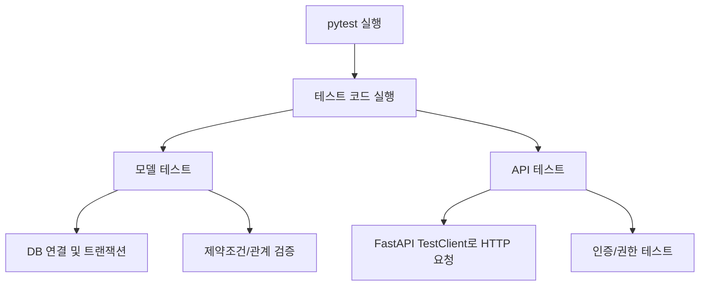

# 테스트 가이드

## 1. 테스트 목적
- 데이터베이스 모델, API 엔드포인트, 인증 등 백엔드의 주요 기능이 정상적으로 동작하는지 자동으로 검증합니다.
- 데이터 저장/조회/수정/삭제, 인증, 권한 등 서비스의 주요 기능이 전체적으로 잘 동작하는지 확인합니다.

## 2. 테스트 구조도



## 3. 테스트 예시 코드

### (1) 모델 테스트 예시
```python
# tests/test_models.py

def test_create_project(db_session):
    project = Project(
        name="테스트 프로젝트",
        code="TEST-001",
        description="테스트용 프로젝트입니다.",
        status="active"
    )
    db_session.add(project)
    db_session.commit()
    saved_project = db_session.query(Project).first()
    assert saved_project.name == "테스트 프로젝트"
    assert saved_project.code == "TEST-001"
```

### (2) API 테스트 예시
```python
# tests/test_api.py

def test_create_project(auth_headers):
    project_data = {
        "name": "테스트 프로젝트",
        "code": "TEST-001",
        "description": "테스트용 프로젝트입니다.",
        "status": "active"
    }
    response = client.post(
        "/api/v1/projects/",
        json=project_data,
        headers=auth_headers
    )
    assert response.status_code == 200
    data = response.json()
    assert data["name"] == project_data["name"]
    assert data["code"] == project_data["code"]
```

## 4. 테스트 실행 방법

1. 가상환경 활성화
   ```bash
   source venv/bin/activate  # (Windows: venv\Scripts\activate)
   ```
2. 의존성 설치
   ```bash
   pip install -r requirements.txt
   ```
3. 테스트 실행
   ```bash
   python -m pytest tests/ -v
   ```
4. 커버리지 확인(선택)
   ```bash
   pytest --cov=.
   ``` 